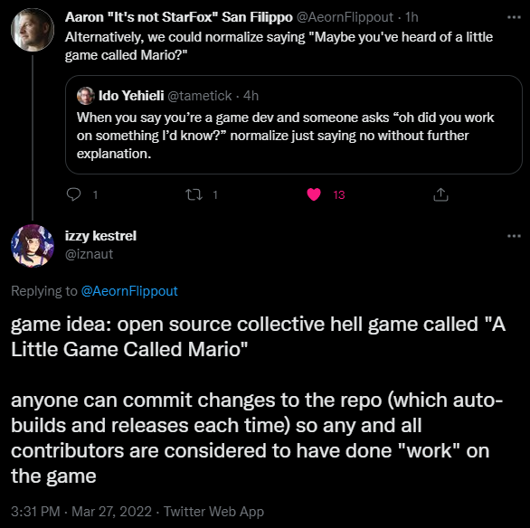

# A Little Game Called Mario
> **open source collective hell game**

a bad idea from the mind of [izzy kestrel](https://twitter.com/iznaut), inspired by [Aaron San Filippo](https://twitter.com/AeornFlippout)

  

# 🎮 [play the latest version here](http://play.little-mario.com/) 🎮

# 🗣 [join the discord server](http://community.little-mario.com/) (by joining our discord you are agreeing to abide by our [code of conduct](code_of_conduct.md)) 🗣

# about
this is (at least to start), a simple 2D platformer game made with Godot Engine. it exists for all to enjoy - not only as players, but also as Game Developers.

finally, we can put the discourse to rest. are you a Game Developer? no? why not? all you have to do is make some changes to this project. it's that simple.

will you add some art? some music? some new gameplay mechanics? dialog? robust multiplayer functionality with rollback netcode? it's up to you.

> **your contributions are valuable regardless of how experienced you are or where your strengths lie.**

even if you never touch a line of code, you're still valuable as a player who can spot things that are wrong and reporting them for others to fix.

> **i would even go so far as to say you're still a Game Developer by simply playtesting and providing QA support - games wouldn't exist without those people!**

this is a game that will live or die by its ability to capture a collective imagination and i like to believe that people can do some pretty amazing things when they organize together under a common goal.

so the next time someone asks, "oh, you're a game developer?" you can proudly say:

**"yes. i worked on A Little Game Called Mario. heard of it?"**

# rules
be kind, respectful, and have empathy for your players and fellow developers. this means:

- adding content that improves the player's experience
- adding comments/tools/utilities that make it easier for less experienced developers to contribute
- removing content that is racist, homophobic, transphobic, ableist, or any other number of things that diminish the work and make it less accessible to anyone who might want to play or contribute to it

your contributions should be additive whenever possible.

> **this is not *your* game, it is everyone's game.**

if you believe changing/removing existing features could improve the game, that's great! but please try to get in touch with the people who originally made those choices and see if you can collaborate rather than disregard their hard work.

> **assume their contributions were made with just as much intentionality as yours and should be just as valued.**

don't be shy about talking to new people, be it to collaborate or just to ask for help! you're all here for the same reason: to make a game.

> **the whole point is collaboration and making new friends.**

## please read through our [code of conduct](code_of_conduct.md)!

# contributing
there are many ways to contribute to the project! games are complex things with a lot of moving parts that only exist because collaboration between creative and technical disciplines makes that happen. here are just a few ways you might be able to help out:

## 🎨 **if you're the creative type** 🎨
make something! anything! it doesn't need to be perfect or polished and it certainly doesn't have to be hooked up via code right away! leave a little gift for the more technical/design-minded folks - their eyes will light up as they think of a dozen different ways it could be implemented as a weird new power-up or something.

[learn more about submitting assets](http://assets.little-mario.com/)

## ⚙️ **if you're the technical type** ⚙️
see if there are any open [issues](https://github.com/a-little-org-called-mario/a-little-game-called-mario/issues) to work on! these can range from bug reports to feature requests and some of them may even be tagged as a "good first issue" for new folks. you can also dig around in closed issues and check out what people are actively working on in pull requests.

[learn more about making code changes](https://github.com/a-little-org-called-mario/a-little-game-called-mario/wiki/Contribution-Basics)

## 🤔 **don't forget the designer types!** 🤔
i think these folks get a bad rap (not just saying that bc i'm one of them!!) - design is important and even tho you can't throw a rock without hitting someone with a "good game idea", what you may not appreciate is how hard it actually can be to execute on! and i'm not talking about learning to code or create art to support your vision....we have plenty of folks here who are already experts at those things! but at the same time, those same folks may not think about problems in the same creative way that you do.

check out the [discussions](https://github.com/a-little-org-called-mario/a-little-game-called-mario/discussions) and [issues](https://github.com/a-little-org-called-mario/a-little-game-called-mario/issues) to see if there are any conversations you might be able to contribute to and don't forget to [join our discord](http://community.little-mario.com/) to see what other folks are talking about!

# 🎮 about the game engine 🎮
[Godot Engine](https://godotengine.org/) is a free and open-source tool for making video games. Check out this video for a very quick primer: [The Godot Game Engine Explained in 5 Minutes](https://www.youtube.com/watch?v=KjX5llYZ5eQ)

you can download Godot here:
- [Windows](https://downloads.tuxfamily.org/godotengine/3.4.4/Godot_v3.4.4-stable_win64.exe.zip)
- [Mac OS X](https://downloads.tuxfamily.org/godotengine/3.4.4/Godot_v3.4.4-stable_osx.universal.zip)
- [Linux](https://downloads.tuxfamily.org/godotengine/3.4.4/Godot_v3.4.4-stable_x11.64.zip)

> **this project was created with v3.4.4 - if you have an older version installed, we recommend upgrading to avoid compatibility issues during development**

Godot is relatively easy to learn but can be fairly powerful. the documentation is very good and includes some helpful resources:
- [Getting Started](https://docs.godotengine.org/en/3.4/getting_started/introduction/index.html)
- [Your First 2D Game](https://docs.godotengine.org/en/stable/getting_started/first_2d_game/index.html)
- [Tutorials and resources](https://docs.godotengine.org/en/stable/community/tutorials.html)

if videos are more your thing, i recommend these channels:
- [GDQuest](https://www.youtube.com/channel/UCxboW7x0jZqFdvMdCFKTMsQ)
- [Godot Tutorials](https://www.youtube.com/channel/UCnr9ojBEQGgwbcKsZC-2rIg)

> this video was used as reference to create the framework for this project: [Make your first 2D platformer game IN JUST 10 MINUTES](https://www.youtube.com/watch?v=xFEKIWpd0sU)

# this is all rad but i'm still intimidated 😱
i could go on for _hours_ about impostor syndrome and all that junk (stuff i feel, just the same as you!!) but some ppl need more encouragement than others so i won't attempt a one-size fits all spiel here 😉

### but if you have questions/feedback/concerns/ideas/whatev PLEASE don't hesitate to ask for help on our [discord server](http://community.little-mario.com/)!!

## with that, i relinquish all creative control of this beautiful beast. godspeed, Little Mario. make mommy proud 💖
